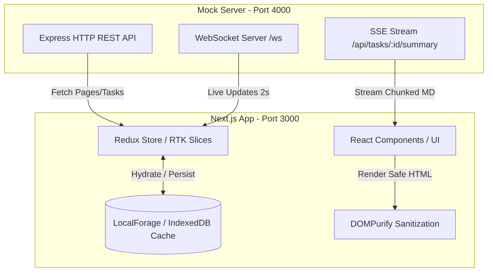

# 📊 Annotation Activity Console

A real-time, resilient annotation activity tracking dashboard featuring a **Next.js** frontend and a **Node.js/Express** mock server backend. The application manages task status, handles real-time streams, sanitizes untrusted AI summaries, and provides offline-capable caching.

---

## 🏗️ Project Architecture & Data Flow

This application is structured into two main components:
1. **Frontend** (`/frontend`): A modern Web application built with Next.js, Redux Toolkit, Tailwind CSS, and local caching (IndexedDB via LocalForage).
2. **Backend** (`/mock-server`): An Express application that serves HTTP REST endpoints, a Server-Sent Events (SSE) stream, and a WebSocket server for real-time task updates.



---

## ⚡ Prerequisites

Make sure you have the following installed on your machine:
- **Node.js** (v18 or higher recommended)
- **npm** (comes packaged with Node.js) or another package manager (Yarn / pnpm)

---

## 🚀 Getting Started & Installation

To set up and run both the frontend and backend, follow these steps.

### Step 1: Clone or Navigate to the Directory
Ensure you are in the root directory of the project:
```bash
cd annotation
```

### Step 2: Install and Run the Mock Server (Backend)

The backend runs a local server that mimics real-time annotation activity database updates.

1. **Navigate to the server directory:**
   ```bash
   cd mock-server
   ```
2. **Install dependencies:**
   ```bash
   npm install
   ```
3. **Start the mock server:**
   ```bash
   npm run mock
   ```
   Once started, you should see the following output in your terminal:
   ```text
   mock on http://localhost:4000 (ws://localhost:4000/ws)
   ```

### Step 3: Install and Run the Console (Frontend)

In a new terminal tab/window, run the Next.js development server.

1. **Navigate to the frontend directory:**
   ```bash
   cd frontend
   ```
2. **Install dependencies:**
   ```bash
   npm install
   ```
3. **Start the development server:**
   ```bash
   npm run dev
   ```
   The application will be served at [http://localhost:3000](http://localhost:3000).

---

## 🛠️ Available Scripts & Commands

Here is a summary of all commands available in each project folder.

### Backend (`/mock-server`)
| Command | Description |
| :--- | :--- |
| `npm run mock` | Starts the Express server, WebSocket endpoint, and SSE service on port `4000`. |

### Frontend (`/frontend`)
| Command | Description |
| :--- | :--- |
| `npm run dev` | Runs the Next.js application in development mode with hot-reloading at `localhost:3000`. |
| `npm run build` | Builds the optimized production version of the Next.js application. |
| `npm run start` | Launches the built production server. |
| `npm run lint` | Runs ESLint rules to identify and fix style/syntax issues. |
| `npm run test` | Runs the test suite via Jest. |

---

## 🔌 API Endpoints & Configuration

By default, the frontend communication is pre-configured to hit the backend at `http://localhost:4000`. You do not need to configure any environment variables to get started.

### REST Endpoints
* **`GET /api/tasks`**: Paginated retrieval of the 137 mock tasks (supports `page` and `pageSize` query parameters).
* **`GET /api/tasks/:id`**: Returns details for a single task by ID.
* **`GET /api/tasks/:id/summary`**: Server-Sent Events (SSE) endpoint that streams chunks of a Markdown summary.

### WebSocket
* **`ws://localhost:4000/ws`**: Emits live updates every 2 seconds simulating task creation, updates, and assignment modifications.

---

## 💡 Key Implementations

> [!NOTE]
> **Data Normalization:** The frontend normalizes incoming REST and WebSocket payloads on the fly (e.g., standardizing mixed statuses, timestamp strings to epochs, and mapping unknown task types).

> [!WARNING]
> **AI Summary Security (XSS Protection):** The streamed AI summaries in `/api/tasks/:id/summary` intentionally contain untrusted script/image injection vectors. The frontend uses `marked` for Markdown parsing and `dompurify` to sanitize outputs before rendering them to the screen. Do not disable or bypass this sanitization layer.

> [!TIP]
> **IndexedDB Caching:** On load, the system instantly hydrates the dashboard using cached data from LocalForage/IndexedDB, displaying a subtle *"Updating from server..."* indicator while it fetches the latest state from the mock server.
